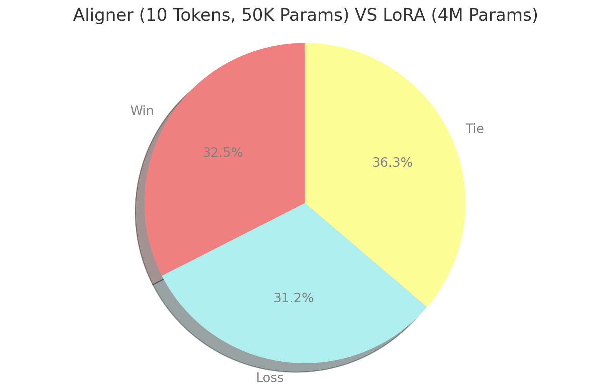
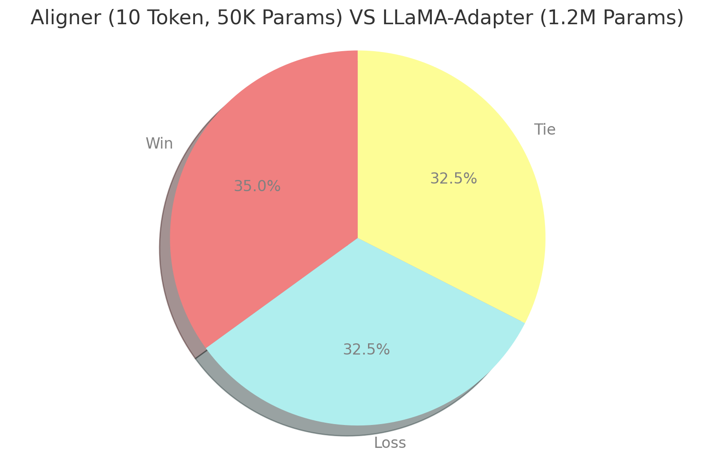

# Aligner

This project implements the Aligner method. Aligner is an extremely paramter efficient method for LLM alignment tasks, utilizing as few as 1 to 10 tokens but still achieves matching performance as that of LoRA and LLaMA-Adapters. See our [arxiv paper](https://arxiv.org/abs/2312.05503 ).

The intuition is that LLMs learn forms or styles differently from learning knowledge or reasoning ability. But what's the difference?  Intuitively, we hypothesize that form guides the whole process of applying knowledge, so form should have global influence over “ability”. Therefore, to learn any desired “form” more efficiently, it may best be regarded a global component.

<div align="center">

</div>

As it turns out, such design achieves extremely high parameter efficiency for alignment tasks, which we include Instruction-Following task and Value Alignment tasks as the representive alignment tasks. Even for reasoning tasks, it is not less efficient. 

# Set Up and Running
## Setup
Clone the repo

```bash
git clone git@github.com:mytemporalaccount/Aligner.git
cd Aligner
```

install dependencies

```bash
pip install -r requirements.txt
```

## Navigating the code
Since our code is based on [Lit-LLaMA](https://github.com/Lightning-AI/lit-llama) framework, please refer to them for how to use this framework.

## Supervised Finetuning with Aligner
```bash
python finetune/aligner.py
```
You can adjust the hyper parameters, dataset and the checkpoint paths in the python script. 

Notice that you need to download the pretrained LLaMA-2 models or similar structure models and convert them to that of lit-llama format. Follow [the guide](howto/download_weights.md) for how to.


## Infer with Aligner

```bash
python generate/aligner.py
```
Notice our provided pretrained Aligner checkpoint is trained with LLaMA-2 7B or 13B. It will still work with LLaMA-1 or any same structure model, but it will suffer some performance drop. For other structure or size models, the checkpoint will not work.

# Method
<div align="center">

</div>

The Aligner architecture implements a global prefix token paradigm. Within a transformer-based model,
we prepend a shared set of N learnable tokens to which each layer attends. Further details are based on the LLaMA-
Adapter’s design. Attention is computed on these tokens and added back to the original attention, modulated by a
gating factor. In practice, we find that N = 1 often already suffices to generate answers of similar quality level as
that of LoRA or LLaMA-Adapter.


# Model Results
## Instruction-Following SFT with Vicuna Benchmark 
**Better or similar performance with hundreds to thousands times less paramters than LoRA**

<div style="text-align: center;">
  <div style="display: inline-flex;">
    
    
  </div>
</div>


With as few as 10 tokens (~50k params), Aligner achieves better win-rate than LoRA (~4 million params) and LLaMA-Adapter(~1.2 million params) for Supervised Finetuning Task with Alpaca dataset on Vicuna benchmark evaluated by GPT4. 


<div align="center">

</div>

 More comprehensive comparisons between Aligner and LoRA, LLaMA-Adapter over both 7B and 13B LLaMA-2 models.

## Value Alignment on PKU-Beaver
**Better or similar performance with hundreds to thousands times less paramters than LoRA**

<div align="center">

</div>

On PKU Beaver Safety Benchmark by category, assessed by GPT-4, Aligner with only 1 token performs on par with LLaMA-Adapter and LoRA.

The models are trained with PKU-Beaver dataset using [Direct Preference Optimization](https://arxiv.org/abs/2305.18290) , an alternative of normal RLHF.


## Reasoning Tasks
**Still very powerful with only a few tokens, and no less powerful if deploying same amount of parameters**

### MMLU Benchmark
<div align="center">

</div>

When directly evaluating Alpaca-tuned only models on MMLU benchmark, a common sense reasoning task for LLMs, Aligner improves the performance to close to that of LoRA and LLaMA-Adapters with only 10 tokens. 

### Finetuning on MetaMath dataset and Evaluating on GSM8K math benchmark

<div align="center">

</div>

The performace increase as the parameter size increases. When Aligner has the same amount of parameters as that of LLaMA-Adapter, it performs just as similar. So Aligner is not less powerful for reasoning tasks.


# Acknowledgement
This code is based on [Lit-LLaMA](https://github.com/Lightning-AI/lit-llama) framework. 
Our algorithm is based on [LLaMA-Adapter](https://github.com/OpenGVLab/LLaMA-Adapter), and our implementation is also based on the implementation of it in Lit-LLaMA.  